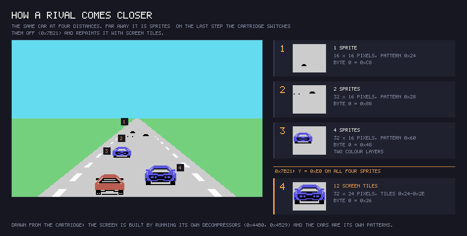
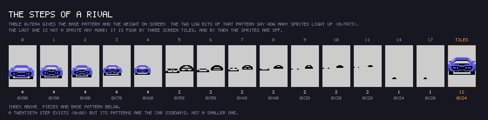
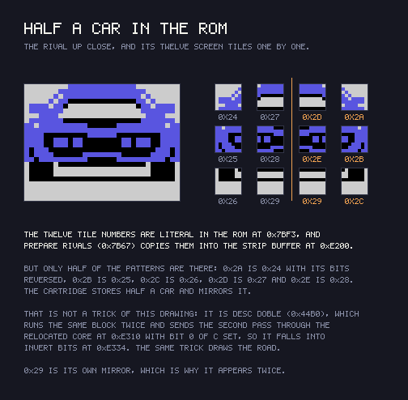

# Findings

## Konami's hidden mark is here

Behind the filler at the end of the ROM, Konami hid in many cartridges its
catalogue number and the title in katakana. The find is not ours: **Manuel
Pazos** ([@ManuelPazosMSX](https://twitter.com/ManuelPazosMSX)) uncovered it and
explained the format. In Hyper Rally the last eleven bytes, from 0x7FF5, are the
title reversed, its length (8), the **18** of RC-718 in BCD, and the 0xAA that
closes the mark. `tools/marca_konami.py` reads it.

## The whole game is one interrupt

INIT falls into a dead `jr` at 0x404F and never returns. Every frame the
interrupt reads the state at 0xE000 and jumps through the nine-handler table at
0x40AA; inside each handler the sub-state at 0xE001 drives a `djnz` chain. It is
a compact way to run a sequence of screens and phases with two bytes of state.

## The road is a lookup, not geometry

0x68D0 turns the curvature at 0xE074 into an index into the shape table at
0x767C. The stripes move by scrolling a buffer (0x707A) at the speed's pace, and
the depth scaling of roadside objects comes from the tables at 0x6CD5. No
multiplies, no divides: everything the road needs is precomputed in tables.

## Twelve stages from eight composers

0xE060 (1..0x0C) selects, through the table at 0x481A, the routine that composes
a stage's background — and several share one, so eight routines cover the
twelve. 0xE061 (table at 0x4372) is not a terrain code but a **bit field** of
what each stage does differently: bit 1 makes the car skid and softens the wheel
(0x65C7 and 0x6658, the snow), 0x01 is the tunnel, 0x10 the storm, 0x08 the
night. The two tables agree exactly — same composer, same 0xE061 — and that
agreement is what proves the reading:

| Stage | Composer | 0xE061 | What you see |
|---|---|---|---|
| 1, 6 | 0x51B8 | 0x00 | day: cyan sky, green hills |
| 2, 10 | 0x586C | 0x01 | tunnel: black, lights along both walls |
| 3, 9 | 0x5A44 | 0x02 | snow: white ground, mountains behind |
| 4 | 0x5B22 | 0x06 | snow under a banded red sky |
| 5 | 0x5B68 | 0x08 | night: black sky, magenta stars |
| 7 | 0x5D5B | 0x10 | storm: grey sky **and a grey border** |
| 8 | 0x51B8 | 0x40 | stage 1 plus a snowy mountain range |
| 11 | 0x5D86 | 0x20 | desert: ochre ground, and three pyramids that rise near the end |
| 12 | 0x5E94 | 0x08 | night: dark blue sky, white stars |

0x51B8 is the generic composer: inside it, at 0x51DA, it tests for 0x40 and only
then adds the mountains, which is how stage 8 can share it. And stage 12's
composer calls stage 5's — the other night stage.

## There is no water stage: it is a starfield

An earlier version of this page said that 0xE061 = 8 meant the stage was run on
water. It does not, and Hyper Rally has no water stage;
[theNestruo](https://github.com/theNestruo) pointed it out. 0xE061 = 8 marks the
two **night** stages, 5 and 12, and 0x71AC does not animate a surface — it
scrolls the sky.

The routine writes into sixteen cells of the name table (0x3884 to 0x3930, rows
4 to 9, the strip of sky), listed at 0x7229 next to their two counters. Tiles
0xF3 to 0xFA are a **single pixel** walking the bottom row of the character
(0x80, 0x40, 0x20, 0x10, 0x08, 0x04, 0x02, 0x01) and 0xFB erases it: eight
sub-positions inside one cell, so each star scrolls at pixel precision, and when
the cycle closes the cell itself steps one column. The delay between steps comes
from the car's speed (table at 0x7215, index = speed >> 5): seventeen frames
stopped, ten flat out. Bit 2 of 0xE075 flips the direction.

## The pyramids rise one row at a time

Stage 11 is the one whose background theNestruo remembered as *appearing line by
line*, and that is exactly how it is drawn. In every other stage 0x707A scrolls
the road stripes; when bit 5 of 0xE061 is set — the desert — it jumps to 0x731D
instead.

That routine keeps a row counter at 0xE06B and does nothing at all until 0xE071,
what is left of the stage, hits **exactly** the threshold the table at 0x7371
holds for the current row: `34 2C 26 20 1C 18 14 10 0E 0C 0A 08 07 06 05 04`.
The gaps close as you get nearer, so the pyramids grow faster the closer the
finish is.

Each time one fires, sixteen bytes are copied into the pattern table from a
**sliding window** over 0x7351 that advances one byte per row. What it slides
over is sixteen zeros followed by `01 03 07 0F 1F 3F 7F FF` and then solid
`FF`: starting inside the zeros and sliding into the triangle is what makes the
shape climb a row at a time. The left half is block-copied; the right half is
written byte by byte through INVIERTE_BITS, so it is the same triangle
**mirrored** — and two mirrored triangles are a pyramid.

Driven through its sixteen steps in openMSX, the four tiles end up exactly as
the ROM predicts: 0xB3 = `01 03 07 0F 1F 3F 7F FF`, 0xB4 solid, 0xB5 =
`80 C0 E0 F0 F8 FC FE FF` (0xB3 with its bits reversed) and 0xB6 solid.

## Close up, a rival stops being sprites

Three rivals, with three-byte records at 0xE090, 0xE093 and 0xE096. 0x79D8
sorts each one into three levels of closeness — it adds 0x10 to the record and
compares against 0x26 and 0x38 — and leaves the level at 0xE09E. 0x7C34 picks
the nearest of the three.

Those three levels are **drawing methods, not sizes**: forcing every rival
through the same branch puts a big car and a small one on screen at once, so
the size comes from a scaled index inside each branch (0x7A10 shifts and offsets
it, and indexes the shadow table at 0x7F47 by the animation phase).

What happens when a rival draws level with you is that **0x7B21 writes 0xE0 into
the Y of its four sprites** — it switches them off. Watched while playing: eight
consecutive passes through it as one rival's record climbed from 0x29 to 0x45
and its level went from 1 to 2, with that car large and right alongside on
screen. So the near rival is not made of those sprites, which is what
[theNestruo](https://github.com/theNestruo) described as sprites first and tiles
when closer.

The scene above is not a capture: the race screen is **built by running the
cartridge's own decompressors in Python** — DESC_DOBLE (0x44B0) for the
background, PINTA_TIRA (0x4529) for the road — and the cars are painted with the
patterns those decompressors leave in VRAM. The sprite patterns come from the
script at 0x488A, and compared against a VRAM dump from the emulator they come
out **identical byte for byte, all 1632 of them**.

### The twenty steps, and why four sprites and not two

The index that comes out of 0x7A19 — byte 0 divided by eight, in two ranges —
indexes the table at **0x7D94**, which gives two bytes per step: the **base
pattern** and the **Y on screen**. The two low bits of that pattern are not part
of the number: 0x7A73 and 0x7A81 read them to **switch off the spare sprites**.

| low bits | sprites | size |
|---|---|---|
| `00` | 4 | 32 × 16, in **two colour layers** |
| `01` | 2 | 32 × 16, single colour |
| `11` | 1 | 16 × 16 |

The four sprites are not a 32 × 32 car: they are **two overlaid pairs**, the
second one with patterns base + 8 and base + 12 and with the colour at 0xE09A
instead of the one at 0xE09B. An MSX1 sprite only takes one colour; this is how
a two-colour car is painted out of two layers, which is what you see up close
and not far away.

The twentieth step (pattern 0x88) is deliberately left out of the drawing: its
patterns are **not a smaller car but the car sideways**, and it needs a byte 0 of
0xF0 or more, which is exactly the value MUEVE_RIVAL compares against at 0x7CA2.
What lights it up is unmeasured.

### The near rival is twelve tiles, and only six are in the ROM

When byte 0 drops below **0x28** the branch is RIVAL_MEDIO (0x7AD1) and the car
is drawn into the **name table**: four tiles wide by three tall, 32 × 24 pixels.
The twelve numbers are literal in the ROM at **0x7BF3**, and PREPARA_RIVALES
(0x7B67) copies them into the strip buffer at 0xE200, interleaving the control
codes PINTA_TIRA understands — the `0x20` that jumps a row and the `0x00` that
closes:

    24 27 2D 2A 20 | 25 28 2E 2B 20 | 26 29 29 2C 20 | FD FD FD FD 00

But of the eleven distinct patterns, **the cartridge only stores six**: 0x2A is
0x24 with its bits reversed, 0x2B is 0x25, 0x2C is 0x26, 0x2D is 0x27 and 0x2E is
0x28. The other half is put there by **DESC_DOBLE** (0x44B0), which runs the same
block twice and sends the second pass through the relocated core at 0xE310,
which with bit 0 of C set falls into INVIERTE_BITS. And 0x29 is its own mirror,
which is why it appears twice in the bottom row.

Where the next one appears is 0x7F65, and only on phase 0 of 0xE003: half the
time (from the refresh register) the X is 0x1F, and otherwise it comes from
(stage − 1) mod 4 — 0x7F, 0x5F, 0x3F, 0x1F. It **cycles every four stages**
rather than growing with the stage. Measured on all twelve, the appearance X is
exactly what that arithmetic predicts, with no exception.

## An opponent has no path of its own

The three-byte record is settled by putting a write watchpoint on each byte and
only recording program counters (`tools/omsx_recorrido.tcl`). Over 45 seconds of
racing, **each byte has exactly one writer** and nothing else touches it:

| byte | written by | times |
|---|---|---|
| 0xE090 | 0x7CE6 | 425 |
| 0xE091 | 0x7D17 | 270 |
| 0xE092 | 0x79D5 | 682 |

Byte 0 is the position relative to you — it wraps the whole way round. Byte 1
is which way the opponent crosses you. And byte 2 is not a property of the
opponent at all: it is **byte 0 as it was on the previous frame**.

**0x7CCB is not an impact.** The listing called it that and said it braked hard
on the collision speed, and it does not touch your speed at all. The only thing
it writes is byte 0:

    ld a,(0e085h) / sub c / rrca x4 / and 00fh    ; (with neg on both sides)
    ld a,(hl) / sub c / ld (hl),a

that is, **byte 0 += (opponent's speed − yours) / 16**. It is the whole engine
of the approach, and there is no other write to byte 0 anywhere in the
cartridge. In a 45-second race with **zero collisions** — 0x7FAC, where a hit is
taken as real, fired 0 times, and so did the shake at 0x7D32 — it ran **1329
times** in that same pass.

The formula was checked without any sampling in between, reading the player's
speed and the opponent's on entry to 0x7CCB and the register A the Z80 had
worked out on the way out (`tools/omsx_paso_rival.tcl`). Redone in Python it
reproduces **102 of 102** distinct cases over those 1329 passes
(`tools/control_recorrido.py`, and `make control` runs it).

## 0xE09C is not a colour, it is the opponent's speed

The listing said 0x79A9 "picks the next opponent's random colour". That byte
**never reaches the VRAM**: the only place that reads it is 0x7C65, inside the
subtraction above. Forcing it settles it — same pilot, same 45 seconds:

| 0xE09C | byte 0 goes up | goes down | net |
|---|---|---|---|
| forced to 0x00 | **never** | 1535 | −9788 |
| forced to 0xFF | 1357 | **never** | +13298 |
| left alone | 1327 | 0 | +5989 |

With the opponent "stopped" you eat all of them; with it flat out they all get
away. The sign flips entirely. A colour would change nothing.

0x79A9 rolls it as **base + (R & 3) × 8**, and the base comes from the stage:
0xA0, or 0x88 when bit 2 of 0xE060 is set. So stages 4-7 and 12 are the ones
that can produce opponents **slower than you** (0x88 = 136 against a measured
top speed of 143), and those are the ones you catch from behind.

## Byte 1 is where YOU were, not which lane it came from

0x7D02 writes it from 0xE121, the X of the first sprite of the player's car, in
four bands. With the pilot sweeping the road side to side, 975 passes through
the `ld (hl),e` at 0x7D17:

| byte 1 | X measured | band in the code |
|---|---|---|
| 0 | 44..88 | < 0x59 |
| 3 | 90..112 | 0x59..0x70 |
| 4 | 114..152 | 0x71..0x98 |
| 1 | 154..195 | ≥ 0x99 |

975 out of 975 inside their own band, no exceptions. (89 never shows up because
the car's X moves two at a time.)

## 0x6B7D does not write to the VRAM: it is the RANK counter

It was called COLOCA_RIVALES_VRAM and it does not write a single cell. What it
does is compare byte 0 against byte 2 — where the opponent is now against where
it was last frame — over the **0x17** threshold, and when one crosses it, move
the three-digit BCD number at 0xE05B/0xE05C: up through 0x6BB5, down through
0x6BC0, and that one also pays SUMA_PUNTOS 0x0250. It leaves through a
`pop hl`, so it moves **at most one place per frame**.

That number is the **RANK** in the bottom right of the dashboard, and you start
the race **680th**: 0x435A loads HL with 0x8006 and drops it into 0xE05B, which
is 0680 in BCD. So an opponent passing you costs you a place and one you pass
gains you one, plus 250 points.

Measured over 45 seconds with the accelerator held down and never steering, the
rank went from 0680 to 0704 — **24 places lost** — and the up branch fired
exactly **24** times, the down branch 0. Which is what should happen: every
opponent in that stage is faster than a car pinned at 143.

## Are there more crossing cars in the later stages?

Not at the same driving, no. Twelve runs, one per stage, same pilot with the
accelerator held down, 40 seconds each (`tools/omsx_cruces_etapa.tcl`):

| stage | bit 2 | crossings | opponent speeds | appearance X |
|---|---|---|---|---|
| 1 | 0 | 18 | A0 A8 B0 B8 | 1F, 7F |
| 2 | 0 | 17 | A0 A8 B0 B8 | 1F, 5F |
| 3 | 0 | 17 | A0 A8 B0 B8 | 1F, 3F |
| 4 | 1 | 15 | **88 90 98** + A0 A8 B0 B8 | 1F |
| 5 | 1 | 15 | **88 90 98** + A0 A8 B0 B8 | 1F, 7F |
| 6 | 1 | 15 | **88 90 98** + A0 A8 B0 B8 | 1F, 5F |
| 7 | 1 | 15 | **88 90 98** + A0 A8 B0 B8 | 1F, 3F |
| 8 | 0 | 18 | A0 A8 B0 B8 | 1F |
| 9 | 0 | 17 | A0 A8 B0 B8 | 1F, 7F |
| 10 | 0 | 17 | A0 A8 B0 B8 | 1F, 5F |
| 11 | 0 | 18 | A0 A8 B0 B8 | 1F, 3F |
| 12 | 1 | 14 | **88 90 98** + A0 A8 B0 B8 | 1F |

The crossings do not grow with the stage — 14 to 18 across all twelve — and the
stages with bit 2 set have **fewer**, not more. What the stage does change is
the other two columns: the appearance X cycles every four, and stages 4-7 and 12
put slower opponents on the road. A slower opponent is one you come up behind
and sit next to instead of one that flashes past, which stays on screen far
longer.

The pilot in these runs never steers and always tops out at 143, so the numbers
compare stages against each other — which is the question — and are not an
absolute count for a real race.

## The storm stage throws lightning

0x724B runs only when 0xE061 is 0x10 — stage 7, the one with the grey sky and,
because 0x418E writes 0xEE into VDP register 7, a grey border as well. After a
random wait (0x18, 0x38, 0x58 or 0x78 frames: half a second to two and a half)
it picks one of the four scripts at 0x72D2 — three distinct shapes — drops it
into row 2 of the name table, plays sound 0x43, flashes the border to 0xEF at
0x7276 and puts it back to 0xEE about a tenth of a second later. It is a
lightning bolt, not the fireworks at the finish line this page used to claim.

## It shares the sound player, little else

Measured with the sixteen-bit operands zeroed, Hyper Rally shares the Konami
three-channel sound player and the VDP helpers with the house's other MSX
cartridges, but it is its own program: the state machine, the road engine and
the collisions were read here, from this ROM.
