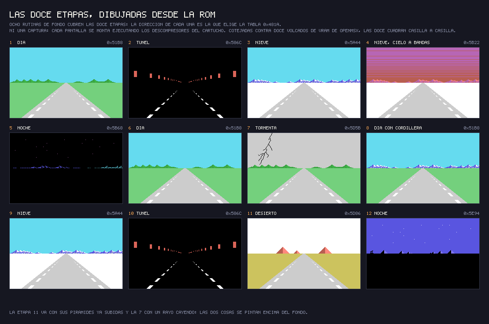
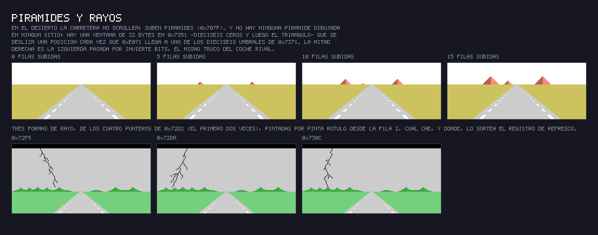
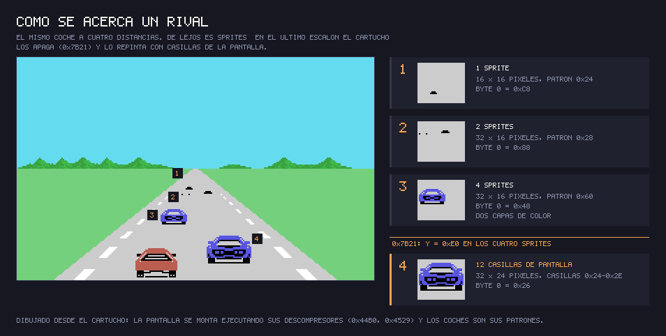
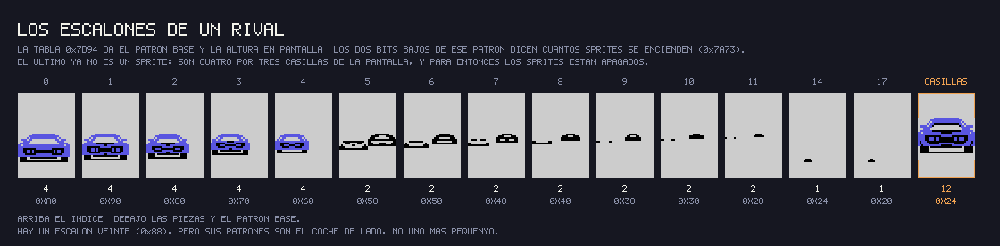
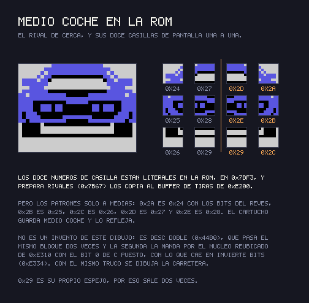

# Hallazgos

## Lleva la marca oculta de Konami

Detrás del relleno del final de la ROM, Konami escondía en muchos cartuchos su
número de catálogo y el título en katakana. El hallazgo no es nuestro: lo
descubrió **Manuel Pazos**
([@ManuelPazosMSX](https://twitter.com/ManuelPazosMSX)) y explicó el formato. En
Hyper Rally los últimos once bytes, desde 0x7FF5, son el título al revés, su
longitud (8), el **18** del RC-718 en BCD, y el 0xAA que cierra la marca.
`tools/marca_konami.py` la lee.

## El acelerador NO se desactiva al chocar: es protección anticopia

En 0x79C8, al final de la rutina que sortea la velocidad del próximo rival, hay
una escritura que este proyecto tenía comentada como *"desactiva el acelerador
tras un choque"*. **No lo hace, y además lo que decía de paso era falso.**

    ld a,0c9h        ;79c6
    ld (06957h),a    ;79c8

El comentario daba por hecho que 0x6957 era un `ret`. No lo es: 0x6957 es el
**primer byte de `ACELERA`**, y lo que hay ahí es `ld a,(0e00ah)`. Lo que hace
la escritura es meter un `0xC9` —un `ret`— encima de ese primer byte, con lo
que `ACELERA` se convertiría en un `ret` pelado y el coche no volvería a
acelerar en toda la partida.

**Se convertiría.** El cartucho corre desde ROM, y la ROM no admite escritura:
en una máquina de verdad esa instrucción no cambia nada. Después de un choque
el acelerador sigue funcionando igual que antes.

Entonces, ¿para qué está? Para lo mismo que la que lleva el RC-720 sobre el
`ret` de su manejador de interrupción: **es protección anticopia**. Un cartucho
pirateado es una copia cargada en RAM, y en RAM la escritura sí cuela. La copia
arranca bien, deja elegir, deja jugar — y al primer choque el coche se queda sin
acelerador. Para entonces quien la copió ya la ha dado por buena.

No es una idea suelta de este cartucho: el mismo truco, con el destino siempre
sobre una instrucción del propio cartucho, aparece en al menos diez de la serie.
Lo identificó **Manuel Pazos** en su desensamblado del RC-727, donde hay dos.

## Todo el juego es una interrupción

INIT cae en un `jr` muerto en 0x404F y no vuelve. Cada cuadro la interrupción lee
el estado de 0xE000 y salta por la tabla de nueve manejadores de 0x40AA; dentro
de cada manejador el subestado de 0xE001 mueve una cadena de `djnz`. Es una forma
compacta de encadenar pantallas y fases con dos bytes de estado.

## La carretera es una tabla, no geometría

0x68D0 convierte la curvatura de 0xE074 en un índice de la tabla de formas de
0x767C. Las rayas se mueven desplazando un buffer (0x707A) al ritmo de la
velocidad, y el escalado de los objetos del borde por profundidad sale de las
tablas de 0x6CD5. Ni multiplicaciones ni divisiones: lo que la carretera necesita
está precalculado en tablas.

## Doce etapas con ocho compositores

0xE060 (1..0x0C) elige, por la tabla de 0x481A, la rutina que compone el fondo de
una etapa —y varias comparten una: ocho rutinas cubren las doce—. 0xE061 (tabla
de 0x4372) no es un código de terreno sino un **campo de bits** con lo que cada
etapa hace distinto: el bit 1 hace derrapar el coche y suaviza el volante
(0x65C7 y 0x6658, la nieve), 0x01 es el túnel, 0x10 la tormenta y 0x08 la noche.
Las dos tablas casan exacto —mismo compositor, mismo 0xE061— y esa coincidencia
es la prueba de que la lectura es la buena:

| Etapa | Compositor | 0xE061 | Lo que se ve |
|---|---|---|---|
| 1, 6 | 0x51B8 | 0x00 | día: cielo cian, colinas verdes |
| 2, 10 | 0x586C | 0x01 | túnel: todo negro, luces en las dos paredes |
| 3, 9 | 0x5A44 | 0x02 | nieve: suelo blanco, montañas al fondo |
| 4 | 0x5B22 | 0x06 | nieve bajo un cielo a bandas rojas |
| 5 | 0x5B68 | 0x08 | noche: cielo negro, estrellas magenta |
| 7 | 0x5D5B | 0x10 | tormenta: cielo gris **y borde gris** |
| 8 | 0x51B8 | 0x40 | la etapa 1 más una cordillera nevada |
| 11 | 0x5D86 | 0x20 | desierto: suelo ocre, y tres pirámides que suben al final |
| 12 | 0x5E94 | 0x08 | noche: cielo azul oscuro, estrellas blancas |

0x51B8 es el compositor genérico: dentro, en 0x51DA, mira si vale 0x40 y sólo
entonces añade las montañas; por eso la etapa 8 puede compartirlo. Y el
compositor de la etapa 12 llama al de la 5, la otra nocturna.

Los doce fondos de arriba **no son capturas**: cada uno se monta ejecutando en
Python el compositor que le toca, con el mismo `DESC_DOBLE` (0x44B0) y el mismo
`PINTA_TIRA` (0x4529) del cartucho, más las rutinas de horizonte, decorado y
carretera. Y hay control: cotejados contra doce volcados de la VRAM que openMSX
tenía delante, **las doce cuadran**. Lo único que se deja fuera del cotejo es lo
que el juego repinta cuadro a cuadro —el rótulo READY, la raya central de la
carretera, la franja del marcador y los tiles del cuentakilómetros—, y eso está
escrito en el propio test.

Las huellas también confirman el reparto: la **1 y la 6**, la **2 y la 10** y la
**3 y la 9** salen byte a byte iguales, porque comparten compositor *y* 0xE061.
La 1 y la 8 comparten compositor pero no parámetro, y no se parecen: la 8 es la
que lleva la cordillera, porque con 0xE061 = 0x40 el propio FONDO_ETAPA_1 se
desvía a la cola de FONDO_ETAPA_3 (0x51DA).

## No hay etapa acuática: es un campo de estrellas

Una versión anterior de esta página decía que 0xE061 = 8 marcaba una etapa
corrida sobre agua. Ni lo marca ni Hyper Rally tiene etapa acuática; lo señaló
[theNestruo](https://github.com/theNestruo). 0xE061 = 8 son las dos etapas **de
noche**, la 5 y la 12, y 0x71AC no anima ninguna superficie: corre el cielo.

La rutina escribe en dieciséis casillas de la tabla de nombres (0x3884 a
0x3930, filas 4 a 9, la franja del cielo), que están listadas en 0x7229 junto a
sus dos contadores. Los tiles 0xF3 a 0xFA son **un solo píxel** recorriendo la
fila de abajo del carácter (0x80, 0x40, 0x20, 0x10, 0x08, 0x04, 0x02, 0x01) y
0xFB lo borra: ocho subposiciones dentro de una casilla, así que cada estrella
corre a precisión de píxel, y al cerrarse el ciclo la casilla salta una columna.
El retardo entre pasos sale de la velocidad del coche (tabla de 0x7215, índice =
velocidad >> 5): diecisiete cuadros parado, diez a tope. El bit 2 de 0xE075 le
cambia el sentido.

## Las pirámides suben de fila en fila

La etapa 11 es aquella cuyo fondo theNestruo recordaba *apareciendo línea a
línea*, y así se dibuja exactamente. En todas las demás etapas 0x707A desplaza
las rayas de la carretera; cuando el bit 5 de 0xE061 está puesto —el desierto—
salta a 0x731D en su lugar.

Esa rutina lleva un contador de fila en 0xE06B y no hace absolutamente nada
hasta que 0xE071, lo que queda de etapa, vale **exactamente** el umbral que la
tabla de 0x7371 guarda para la fila que toca: `34 2C 26 20 1C 18 14 10 0E 0C 0A
08 07 06 05 04`. Los huecos se van cerrando conforme te acercas, así que las
pirámides crecen más deprisa cuanto más cerca está la meta.

Cada vez que uno se cumple se copian dieciséis bytes a la tabla de patrones
desde una **ventana deslizante** sobre 0x7351 que avanza un byte por fila. Por
lo que desliza es dieciséis ceros seguidos de `01 03 07 0F 1F 3F 7F FF` y luego
`FF` macizo: empezar dentro de los ceros e ir entrando en el triángulo es lo que
hace que la forma suba de fila en fila. La mitad izquierda va de un bloque; la
derecha se escribe byte a byte pasando por INVIERTE_BITS, o sea el mismo
triángulo **espejado** —y dos triángulos espejados son una pirámide—.

Llevada a mano por sus dieciséis pasos en openMSX, los cuatro tiles quedan
exactamente como dice la ROM: 0xB3 = `01 03 07 0F 1F 3F 7F FF`, 0xB4 macizo,
0xB5 = `80 C0 E0 F0 F8 FC FE FF` (0xB3 con los bits del revés) y 0xB6 macizo.

Dibujadas desde la ROM, subiendo paso a paso. Y de paso se ve el otro efecto que
va **encima** del fondo: el rayo de la tormenta, que se pinta con la tercera
rutina de dibujo del cartucho —`PINTA_ROTULO` (0x455A), la que se copia a 0xE1C0
y corre en la RAM— desde la fila 2. Los cuatro punteros de 0x72D2 dan **tres**
formas distintas: la primera está repetida.

## De cerca, el rival deja de ser sprites

Son tres rivales, con fichas de tres bytes en 0xE090, 0xE093 y 0xE096. 0x79D8
clasifica a cada uno en tres niveles de cercanía —suma 0x10 a la ficha y compara
contra 0x26 y 0x38— y deja el nivel en 0xE09E. 0x7C34 se queda con el más
cercano de los tres.

Esos tres niveles son **métodos de dibujo, no tallas**: forzando a todos los
rivales por la misma rama salen a la vez un coche grande y uno pequeño, o sea
que la talla la pone un índice escalado dentro de cada rama (0x7A10 lo desplaza
y lo desvía, e indexa la tabla de sombras de 0x7F47 por la fase de animación).

Lo que pasa cuando un rival se te pone al lado es que **0x7B21 escribe 0xE0 en
la Y de sus cuatro sprites**: los apaga. Visto jugando: ocho pasadas seguidas
por ahí mientras la ficha de un rival subía de 0x29 a 0x45 y su nivel pasaba de
1 a 2, con ese coche grande y pegado en pantalla. Así que el rival cercano no
son esos sprites, que es lo que
[theNestruo](https://github.com/theNestruo) describía como sprites primero y
tiles al acercarse.

La escena de arriba no es una captura: la pantalla de carrera está **montada
ejecutando en Python los descompresores del cartucho** —DESC_DOBLE (0x44B0) para
el fondo, PINTA_TIRA (0x4529) para la carretera— y los coches están pintados con
los patrones que esos descompresores dejan en la VRAM. Los patrones de sprite
salen del guión de 0x488A, y comparados con un volcado de VRAM del emulador
salen **iguales byte a byte, los 1632**.

### Los veinte escalones, y por qué cuatro sprites y no dos

El índice que sale de 0x7A19 —el byte 0 partido por ocho, con dos tramos— indexa
la tabla de **0x7D94**, que da dos bytes por escalón: el **patrón base** y la
**Y en pantalla**. Los dos bits bajos de ese patrón no son parte del número:
0x7A73 y 0x7A81 los miran para **apagar los sprites que sobran**.

| bits bajos | sprites | de qué tamaño |
|---|---|---|
| `00` | 4 | 32 × 16, en **dos capas de color** |
| `01` | 2 | 32 × 16, de un color |
| `11` | 1 | 16 × 16 |

Los cuatro sprites no son un coche de 32 × 32: son **dos parejas superpuestas**,
la segunda con los patrones base + 8 y base + 12 y con el color de 0xE09A en vez
del de 0xE09B. Un sprite del MSX1 sólo admite un color; así se pinta un coche de
dos colores con dos capas, que es lo que se ve de cerca y no se ve de lejos.

El vigésimo escalón (patrón 0x88) queda fuera del dibujo a propósito: sus
patrones **no son el coche más pequeño, sino el coche de lado**, y pide un byte 0
de 0xF0 para arriba, que es justo el valor contra el que MUEVE_RIVAL compara en
0x7CA2. Qué lo enciende, sin medir.

### El rival de cerca son doce casillas, y sólo seis están en la ROM

Cuando el byte 0 baja de **0x28**, la rama es RIVAL_MEDIO (0x7AD1) y el coche se
dibuja en la **tabla de nombres**: cuatro casillas de ancho por tres de alto,
32 × 24 píxeles. Los doce números están literales en la ROM en **0x7BF3**, y
PREPARA_RIVALES (0x7B67) los copia al buffer de tiras de 0xE200 intercalando los
códigos de control que PINTA_TIRA entiende —el `0x20` que salta de fila y el
`0x00` que cierra:

    24 27 2D 2A 20 | 25 28 2E 2B 20 | 26 29 29 2C 20 | FD FD FD FD 00

Pero de los once patrones distintos, **el cartucho sólo guarda seis**: 0x2A es
0x24 con los bits del revés, 0x2B es 0x25, 0x2C es 0x26, 0x2D es 0x27 y 0x2E es
0x28. La otra mitad la pone **DESC_DOBLE** (0x44B0), que pasa el mismo bloque dos
veces y la segunda la manda por el núcleo reubicado de 0xE310, que con el bit 0
de C puesto cae en INVIERTE_BITS. Y 0x29 es su propio espejo, por eso aparece dos
veces en la fila de abajo.

Dónde aparece el siguiente lo decide 0x7F65, y sólo en la fase 0 de 0xE003: la
mitad de las veces (por el registro de refresco) la X es 0x1F, y si no sale de
(etapa − 1) mod 4 — 0x7F, 0x5F, 0x3F, 0x1F. **Cicla cada cuatro etapas**, no
crece con la etapa. Medida en las doce, la X de aparición es exactamente la que
predice esa cuenta, sin una sola excepción.

## Un rival no tiene recorrido propio

La ficha de tres bytes se cierra poniendo un punto de observación de escritura
sobre cada byte y apuntando sólo contadores de programa
(`tools/omsx_recorrido.tcl`). En 45 segundos de carrera, **cada byte tiene
exactamente un escritor** y nadie más lo toca:

| byte | quién lo escribe | veces |
|---|---|---|
| 0xE090 | 0x7CE6 | 425 |
| 0xE091 | 0x7D17 | 270 |
| 0xE092 | 0x79D5 | 682 |

El byte 0 es la posición relativa a ti, y da la vuelta entera. El byte 1 es por
dónde te cruza. Y el byte 2 no es una propiedad del rival: es **el byte 0 tal
como estaba el cuadro anterior**.

**0x7CCB no es un impacto.** El listado lo llamaba así y decía que frenaba de
golpe según la velocidad del choque, y no toca tu velocidad para nada. Lo único
que escribe es el byte 0:

    ld a,(0e085h) / sub c / rrca x4 / and 00fh    ; (con neg a los dos lados)
    ld a,(hl) / sub c / ld (hl),a

o sea **byte 0 += (velocidad del rival − la tuya) / 16**. Es el motor entero del
acercamiento, y no hay ninguna otra escritura sobre el byte 0 en todo el
cartucho. En una carrera de 45 segundos con **cero choques** —0x7FAC, donde un
golpe se da por bueno, saltó 0 veces, y la sacudida de 0x7D32 tampoco— corrió
**1329 veces** en esa misma pasada.

La fórmula se comprobó sin ningún muestreo por medio, leyendo la velocidad del
jugador y la del rival a la entrada de 0x7CCB y el registro A que el Z80 había
calculado a la salida (`tools/omsx_paso_rival.tcl`). Rehecha en Python
reproduce **102 de 102** casos distintos sobre esas 1329 pasadas
(`tools/control_recorrido.py`, y `make control` lo ejecuta).

## 0xE09C no es un color: es la velocidad del rival

El listado decía que 0x79A9 "elige el color aleatorio del próximo rival". Ese
byte **no llega nunca a la VRAM**: el único sitio que lo lee es 0x7C65, dentro
de la resta de arriba. Forzarlo lo zanja —mismo piloto, mismos 45 segundos—:

| 0xE09C | el byte 0 sube | baja | neto |
|---|---|---|---|
| forzado a 0x00 | **ninguna vez** | 1535 | −9788 |
| forzado a 0xFF | 1357 | **ninguna vez** | +13298 |
| sin tocar | 1327 | 0 | +5989 |

Con el rival "parado" te los comes a todos; con el rival a tope se te escapan
todos. El signo se invierte entero. Si fuese un color no cambiaría nada.

0x79A9 lo sortea como **base + (R & 3) × 8**, y la base sale de la etapa: 0xA0, o
0x88 con el bit 2 de 0xE060 puesto. O sea que las etapas 4-7 y 12 son las que
pueden dar rivales **más lentos que tú** (0x88 = 136 contra un tope medido de
143), y a ésos los alcanzas por detrás.

## El byte 1 es dónde estabas TÚ, no el carril del que venía

0x7D02 lo escribe mirando 0xE121, la X del primer sprite del coche del jugador,
repartida en cuatro franjas. Con el piloto barriendo la carretera de lado a
lado, 975 pasadas por el `ld (hl),e` de 0x7D17:

| byte 1 | X medida | franja en el código |
|---|---|---|
| 0 | 44..88 | < 0x59 |
| 3 | 90..112 | 0x59..0x70 |
| 4 | 114..152 | 0x71..0x98 |
| 1 | 154..195 | ≥ 0x99 |

975 de 975 dentro de su franja, cero excepciones. (El 89 no aparece porque la X
del coche va de dos en dos.)

## La escritura de 0x7CFF va un byte corrida, y no puede saltar nunca

Una respuesta anterior en el issue #3 decía que 0x7CFF era un segundo escritor
del **byte 0**, con una puerta `cp 0f0h / ret c` sobre el **byte 1**, y que en
45 segundos no llegó a saltar. Dos de las tres cosas estaban mal, y la tercera
se midió con el juego parado.

`RIVAL_COLISION` (0x7A00) hace `inc hl` en 0x7A02 *antes* del `call`, así que
dentro de `DETECTA_CHOQUE` (0x7CE8) HL ya está en el **byte 1**. Y eso corre
todo un byte:

- la puerta lee el **byte 2** —el byte 0 del rival en el cuadro anterior, la
  misma pareja que usa el marcador de puesto de 0x6B7D—
- lo que escribe 0x7CFF es el **byte 1**

Medido en openMSX con puntos de ruptura en toda la cadena —0x7A00, el `call` de
0x7A15, 0x7CE8 y 0x7CFF—, en tres tiradas (45 s y 90 s de la etapa 1, 120 s de
la etapa 5):

| | |
|---|---|
| llamadas a DETECTA_CHOQUE | **5.804** |
| veces que se abre la puerta | **0** |
| el mayor byte 2 visto en la puerta | 0xEE |

Y conduciendo no se puede abrir. Para llegar siquiera al `call`,
`RIVAL_COLISION` pide el byte 0 entre 0x28 y 0xEF: de 0xF0 en adelante el
`add a,010h` da la vuelta y se sale por RIVAL_REPARTE. Así que la puerta
necesita que el byte 0 salte de 0xF0..0xFF a 0x28 o más en un solo cuadro, o sea
un avance de **+0x29** por lo menos. En 4.368 cuadros-ficha el mayor avance
medido fue **+0x0B**.

Y lo de "en 45 segundos no saltó ni una vez" salió de una sonda que ponía la
etapa en 0xE060 y nunca llegaba a arrancar la carrera: el juego se quedaba en la
pantalla de atracción, donde ninguna de estas rutinas corre. Todos los
contadores de aquella sonda daban cero, que era la pista.

## 0x6B7D no escribe en la VRAM: es el marcador RANK

Se llamaba COLOCA_RIVALES_VRAM y no escribe una sola casilla. Lo que hace es
comparar el byte 0 con el byte 2 —dónde está el rival ahora contra dónde estaba
el cuadro anterior— contra el umbral **0x17**, y cuando uno lo cruza, mueve el
número BCD de tres dígitos de 0xE05B/0xE05C: arriba por 0x6BB5, abajo por
0x6BC0, y ésa además paga SUMA_PUNTOS 0x0250. Sale por un `pop hl`, así que
mueve **como mucho un puesto por cuadro**.

Ese número es el **RANK** de abajo a la derecha del salpicadero, y se empieza la
carrera **el 680**: 0x435A carga HL con 0x8006 y lo mete en 0xE05B, que en BCD
es 0680. O sea que un rival que te pasa te cuesta un puesto y uno al que pasas
te gana uno, más 250 puntos.

Medido en 45 segundos con el acelerador clavado y sin girar nunca, el puesto
pasó de 0680 a 0704 —**24 puestos perdidos**— y la rama que sube saltó
exactamente **24** veces, la que baja 0. Que es lo que tiene que pasar: en esa
etapa todos los rivales son más rápidos que un coche clavado a 143.

## ¿Hay más coches cruzando en las etapas altas?

A igualdad de conducción, no. Doce pasadas, una por etapa, mismo piloto con el
acelerador clavado, 40 segundos cada una (`tools/omsx_cruces_etapa.tcl`):

| etapa | bit 2 | cruces | velocidades del rival | X de aparición |
|---|---|---|---|---|
| 1 | 0 | 18 | A0 A8 B0 B8 | 1F, 7F |
| 2 | 0 | 17 | A0 A8 B0 B8 | 1F, 5F |
| 3 | 0 | 17 | A0 A8 B0 B8 | 1F, 3F |
| 4 | 1 | 15 | **88 90 98** + A0 A8 B0 B8 | 1F |
| 5 | 1 | 15 | **88 90 98** + A0 A8 B0 B8 | 1F, 7F |
| 6 | 1 | 15 | **88 90 98** + A0 A8 B0 B8 | 1F, 5F |
| 7 | 1 | 15 | **88 90 98** + A0 A8 B0 B8 | 1F, 3F |
| 8 | 0 | 18 | A0 A8 B0 B8 | 1F |
| 9 | 0 | 17 | A0 A8 B0 B8 | 1F, 7F |
| 10 | 0 | 17 | A0 A8 B0 B8 | 1F, 5F |
| 11 | 0 | 18 | A0 A8 B0 B8 | 1F, 3F |
| 12 | 1 | 14 | **88 90 98** + A0 A8 B0 B8 | 1F |

Los cruces no crecen con la etapa —de 14 a 18 en las doce— y las etapas con el
bit 2 puesto tienen **menos**, no más. Lo que sí cambia con la etapa son las
otras dos columnas: la X de aparición cicla cada cuatro, y las etapas 4-7 y 12
ponen rivales más lentos en la carretera. Un rival lento es uno al que llegas
por detrás y con el que te quedas emparejado, en vez de uno que te pasa de
largo, y ése se queda en pantalla mucho más rato.

El piloto de estas pasadas no gira nunca y siempre llega a 143, así que los
números comparan unas etapas con otras —que es lo que se pregunta— y no son una
cuenta absoluta de una carrera de verdad.

## La etapa de tormenta echa rayos

0x724B sólo corre cuando 0xE061 vale 0x10 —la etapa 7, la del cielo gris y,
porque 0x418E escribe 0xEE en el registro 7 del VDP, también el borde gris—.
Tras una espera al azar (0x18, 0x38, 0x58 o 0x78 cuadros: de medio segundo a dos
y medio) elige uno de los cuatro guiones de 0x72D2 —tres formas distintas—, lo
suelta en la fila 2 de la tabla de nombres, arranca el sonido 0x43, pone el
borde en 0xEF en 0x7276 y lo devuelve a 0xEE una décima después. Es un rayo, no
los fuegos artificiales de meta que esta página venía diciendo.

## Comparte el reproductor de sonido, poco más

Medido con los operandos de dieciséis bits puestos a cero, Hyper Rally comparte
el reproductor de sonido de tres canales de Konami y las rutinas del VDP con los
otros cartuchos de MSX de la casa, pero es su propio programa: la máquina de
estados, el motor de carretera y las colisiones se leyeron aquí, en esta ROM.
